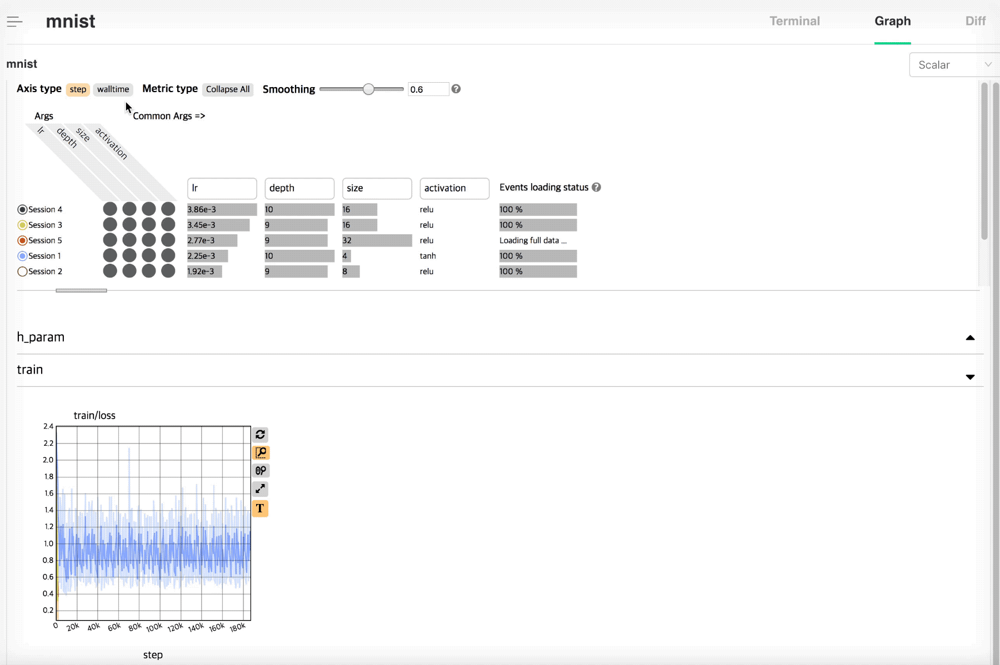

.. _graph:

Graph
-----

.. _tensorboard: https://www.tensorflow.org/guide/summaries_and_tensorboard
.. _reservoir: https://en.wikipedia.org/wiki/Reservoir_sampling

    :ref:`nsml.report()<nsml.report()>` 로 전달된 변수값들의 변화량 (scalar value) 을 실시간으로 볼 수 있습니다.

    NSML scalar plot은 아래 그림과 같이 Controller, Meta info., 그리고 Body 세 부분으로 구성되어 있습니다.

    .. figure:: ../../static/nsml_web_plot/scalarPlot_teaser.png

Graph Controller
================

Graph 전체를 제어하는 기능들을 사용할 수 있습니다.

- Axis type: x축을 step 기준, 혹은 walltime 기준으로 변경해서 볼 수 있습니다.

- Metric type: 그래프에서 확인하고 싶은 변량이 많을 경우, 확인하고자 하는 변량 그래프를 편하게 확인할 수 있도록 모든 그래프를 접고, 펼칠 수 있습니다.

.. note:: NSML scalar graph에서는 metric type의 기준을 '/'의 구분자를 이용하여 구분합니다.

- Smoothing: Tensorboard에서 지원하는 각 sessiond graph의 line smoothness를 조절할 수 있습니다. (ref.: `tensorboard`_)

Meta Info.
==========

Session의 meta data 중 'args'와 같이 graph 분석 시 용이한 정보들을 재표현하여 보여주며, events data의 loading 상황을 보여줍니다.

.. figure:: ../../static/nsml_web_plot/scalarPlot_metaVis.gif

만약 관심있는 session이 단일일 경우, session을 시작할 때 입력한 args는 단순한 text로 나열됩니다.
만약 여러 session을 함께 볼 경우, session들의 공통된 args, 공통되지 않은 args를 분리하여 보여줍니다. 공통되지 않은 args에서는 아래와 같은 기능들을 활용하실 수 있습니다.

.. note:: Meta Info. panel에서 표현되는 'args'는 session 생성시 '--args'에 입력된 값들만을 이용하여 표현합니다.

- Toggle

각 세션의 이름 옆의 toggle 버튼을 통해 각 session의 plot을 toggle on/off 할 수 있습니다.

- Sort

여러 세션을 비교, 분석 시 특정 argument 값을 기준으로 sort하여 원하는 세션들을 보기 편하게 나열할 수 있습니다.

- Args selection

세션이 가지고 있는 argument의 갯수가 많을 경우, selection column에서 원하는 argument를 선별적으로 선택하여 확인할 수 있습니다.

- Events loading status

NSML scalar plot에서는 수 많은 데이터 로딩으로 인한 web의 종료를 방지하기 위해 'Reservoir sampling'을 샘플링 기법으로 사용합니다 (ref.: `reservoir`_).
해당 sampling 기법은 unknown size, large size streaming data를 plotting 하기 위해 주로 사용되는 기법입니다.

.. note:: 각 plot line이 가질 수 있는 최대 scalar의 수는 1,000개로 제한되어 있습니다.
.. note:: 기존에 사용되었던 쪼개어진 작은 event 데이터들을 순차적으로 불러오는 방식은 더 이상 사용하지 않습니다.

Graph Body
==========

선택된 session 의 변량 그래프를 확인할 수 있습니다.

.. figure:: ../../static/nsml_web_plot/scalarPlot_graphBody.gif

변량 그래프에서는 아래의 기능들을 지원합니다.

- Mouse hovering & highlight session

plot안에서 현재 가장 가까운 session line을 탐색하고, 해당 session line을 굵은 선으로 hightlight하며,
tooltip table에서 bold type으로 표현된 해당 session을 확인할 수 있습니다.
또한 위에서 언급한 Meta Info. panel안에서 해당 세션 또한 hightlight 시켜 현재 세션이 어떤 argument를 가지고 있는 세션인지 쉽게 확인할 수 있습니다.

- Zoom

NSML Scalar plot에서는 기본적으로 box zoom을 사용합니다. 원하는 영역을 마우스를 이용해 선택하고, 확대된 화면을 보실 수 있습니다. 만약 zoom을 초기화하고 싶다면,
마우스로 영역을 만들지 않고, plot 안에서 단순한 click을 통해 초기화 할 수 있습니다. 또한 plot 옆의 'zoom reset' 버튼을 이용하여 초기화할 수 있습니다.

- Sub utils

각 plot 오른쪽의 util들을 활용하여 아래 기능들을 활용할 수 있습니다.

    - Zoom reset

    Zoom을 초기화합니다. 현재 데이터의 영역에 맞게 plot이 초기화됩니다.

    - Zoom type

    Zoom type을 변경하실 수 있습니다. 기본적으로 box zoom을 사용하며, mouse wheel 기반의 zoom 기능으로 변경하여 사용할 수 있습니다.

    - Expand Plot

    Plot을 보다 큰 크기로 볼 수 있습니다.

    - Text on/off

    Mouse hovering시 표현되는 text를 on/off 할 수 있습니다.
